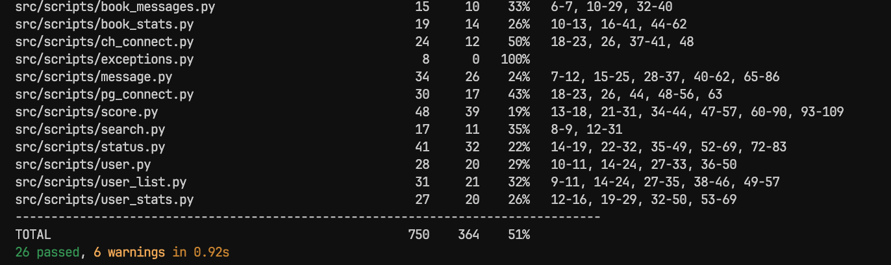

# Recommendation System for Book Discovery

[](https://docs.docker.com/compose/)
[](https://fastapi.tiangolo.com/)
[](https://react.dev/)
[](https://www.typescriptlang.org/)

## Features

- Personalized book recommendations
- Reading list management (Read / Reading / Planned)
- 1–5 star rating system
- Weekly trending books
- Books top lists

## Quick start

Use **Python 3.13.x** for local installs (same as Docker). **3.14 is not supported** yet: `pydantic-core` builds with PyO3, which currently rejects 3.14, which leads to broken `pydantic_core` and FastAPI import errors. With Poetry: `poetry env use python3.13` (or `pyenv local 3.13` if you use `.python-version`), then remove `.venv` and run `poetry install` again if you already created the env on 3.14.

1. Copy `.env.example` to `.env` and adjust secrets (especially `JWT_SECRET_KEY`).
2. Start the stack, for example: `docker compose up --build -d`
3. Run the unit-test container when needed: `docker compose up --build -d tester`

**Auth & database notes**

- Authentication uses JWT access and refresh tokens from the backend; passwords are bcrypt hashes in PostgreSQL. Configure `JWT_SECRET_KEY` and related variables in `.env` (see `.env.example`).
- If you upgrade an older database missing `password_hash` / `email` on `"User"`, run `migrations/add_user_auth_columns.sql` and backfill passwords before enforcing `NOT NULL`.

## Access points

Default host ports match `.env.example`. Override them in `.env` if needed.

| Environment | Service              | Endpoint                         | Default credentials   |
|-------------|----------------------|----------------------------------|------------------------|
| Local       | Web UI (Nginx + React) | http://localhost:80            | —                      |
| Local       | Backend API (direct) | http://localhost:8000            | —                      |
| Local       | Airflow UI           | http://localhost:8080            | `admin` / `admin`      |
| Local       | Grafana              | http://localhost:3000            | `admin` / `admin`      |
| Local       | Prometheus           | http://localhost:9090            | —                      |
| Local       | PostgreSQL (app)     | `localhost:5433` (TCP)          | `backend` / `backend`  |
| Local       | PostgreSQL (Airflow) | `localhost:5432` (TCP)          | `airflow` / `airflow`  |
| Local       | ClickHouse (HTTP)    | http://localhost:8124          | `clickhouse` / `clickhouse` |
| Local       | ClickHouse (native)  | `localhost:9001` (TCP)          | `clickhouse` / `clickhouse` |
| Production  | Live site            | —                                | —                      |

## Architecture

| Layer / concern   | Technology |
|-------------------|------------|
| Runtime           | Python 3.13 |
| Dependencies      | Poetry (`pyproject.toml`) |
| Backend           | FastAPI, Uvicorn |
| Frontend          | React 19, TypeScript, React Router v7, Axios, Vite |
| Auth              | JWT (python-jose), bcrypt, PostgreSQL |
| ETL / orchestration | Apache Airflow |
| Transactional DB  | PostgreSQL |
| Analytics DB      | ClickHouse |
| Metrics           | Prometheus (`prometheus-client` in app), Postgres exporters |
| Dashboards        | Grafana |
| Containers        | Docker Compose; Kubernetes manifests under `k8s/` |

## Testing

- **Docker:** `docker compose up --build -d tester` — the `tester` service waits for PostgreSQL and the backend, then runs `pytest tests/ -v` (see `wait_for_services.sh`).
- **Local (Poetry, Python 3.13):** e.g. `poetry add --group dev pytest pytest-cov`, then `poetry run pytest tests/ -v` or `poetry run pytest --cov=src tests/ -v`.
- **Local (pip only):**

```bash
pip install pytest pytest-cov
pytest --cov=src tests/ -v
```

Coverage snapshot (external course repo):  


## Team

| Member              | Role        |
|---------------------|-------------|
| Denis Troegubov     | Data engineer |
| Danila Kochegarov   | Backend     |
| Peter Zavadskii     | SRE         |
| Daniil Tskhe        | Backend     |
| Arina Zimina        | Frontend    |
